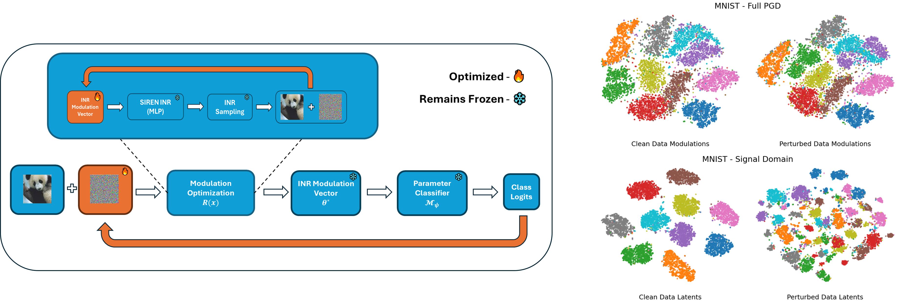

# Adversarial Attacks for Weight-Space Classifiers
**Tamir Shor, Ethan Fetaya, Chaim Baskin, Alex Bronstein**  
</br>
This repository contains the official implementation of the paper:
**[Adversarial Robustness in Parameter-Space Classifiers](https://arxiv.org/abs/2502.20314)** </br>

🚀 Accepted as a **spotlight** at the [ICLR 2025 Workshop on Weight-Space Learning](https://weight-space-learning.github.io/).




## Installation

To set up the environment, install the dependencies using Conda:

```bash
conda env create -f environment.yml
conda activate pss
```

## Usage & Result Reproduction

In the following sections we provide instructions for full recreation of results from the paper for each of our three considered baselines - MNIST, Fashion-MNIST and ModelNet10. \\
Our experimental pipeline is compsoed of 3 stages -in section [Functaset Creation](#functaset-creation) we provide information on creating our datasets of SIREN modulation vectors according [to Dupont et al](https://arxiv.org/abs/2201.12204).
These datasets are used for the 'clean' training of the weight-space classifiers (without incorporation of adversarial attacks). Insturctions for performing 'clean' classifier training are in section ['Clean' Classifier Training](#clean-classifier-training).
Finally, we provide usage examples and instructions for paper-results recreation for each attack in our suite in section [Adversarial Attacks](#adversarial-attacks). 


### Functaset Creation
1. **Train a SIREN in meta-optimization:**
   - MNIST:
     ```bash
     python trainer.py --dataset mnist --data-path <path to MNIST dataset>
     ```
   - Fashion-MNIST:
     ```bash
     python trainer.py --dataset fmnist --data-path <path to Fashion-MNIST dataset>
     ```
   - ModelNet10:
     ```bash
     python trainer.py --dataset modelnet --data-path <path to ModelNet10 dataset> --batch-size 32 --num-epochs 20 --mod-dim 2048
     ```

2. **Create the Functaset:**
   - MNIST:
     ```bash
     python makeset.py --dataset mnist --data-path <path to MNIST dataset> --iters 5 --checkpoint <path to your MNIST pre-trained SIREN>/modSiren.pth
     ```
   - Fashion-MNIST:
     ```bash
    python makeset.py --dataset fmnist  --data-path <path to Fashion-MNIST dataset> --iters 20 --checkpoint <path to your Fashion-MNIST pre-trained SIREN>/modSiren.pth
     ```
   - ModelNet10:
     ```bash
     python makeset.py --dataset modelnet --data-path <path to ModelNet10 dataset>  --iters 500 --mod-dim 2048 --checkpoint <path to your ModelNet10 pre-trained SIREN>/modSiren.pth
     ```

### 'Clean' Classifier Training
   - MNIST:
     ```bash
     python train_classifier.py --lr 0.01  --cwidth 512 --mod-dim 512 --dropout 0.2 --cdepth 3 --batch-size 256 --dataset mnist --num-epochs 40 --data-path <path to MNIST dataset> --functaset-path-train <path to your MNIST functaset>/mnist_train.pkl --functaset-path-test <path to your MNIST functaset>/mnist_test.pkl 
     ```
   - Fashion-MNIST:
     ```bash
     python train_classifier.py --lr 0.01  --cwidth 2048 --mod-dim 512 --dropout 0.4 --num-epochs 60 --cdepth 1  --batch-size 256 --dataset fmnist  --data-path <Fashion-MNIST dataset path> --functaset-path-train <path to your MNIST functaset>/fmnist_train.pkl --functaset-path-test <path to your Fashion-MNIST functaset>/fmnist_test.pkl 
     ```
   - ModelNet10:
     ```bash
     python train_classifier.py --lr 0.001  --cwidth 512 --dropout 0.6 --cdepth 1  --batch-size 1024 --dataset modelnet --num-epochs 600 --mod-dim 2048 --data-path <path to ModelNet10 dataset> --functaset-path-train <path to your ModelNet10 functaset>/modelnet_train.pkl --functaset-path-test <path to your ModelNet10 functaset>/modelnet_test.pkl  
     ```

### Adversarial Attacks
1. **Full PGD**
   - MNIST:
     ```bash
     python attacks/full_pgd.py --cwidth 512 --mod-dim 512  --cdepth 3 --dataset mnist  --data-path <MNIST dataset path> --siren-checkpoint  <path to your MNIST pre-trained SIREN>/modSiren.pth --classifier-checkpoint <path to your pretrained MNIST classifier>/best_classifier.pth --epsilon 16

     ```
   - Fashion-MNIST:
     ```bash
     python attacks/full_pgd.py --cwidth 2048 --mod-dim 512 --mod-steps 20 --cdepth 1  --dataset fmnist  --data-path <Fashion-MNIST dataset path> --siren-checkpoint  <path to your Fashion-MNIST pre-trained SIREN>/modSiren.pth --classifier-checkpoint <path to your pretrained Fashion-MNIST classifier>/best_classifier.pth --epsilon 16
     ```
2. **TMO**
   - MNIST:
     ```bash
     python attacks/tmo.py --cwidth 512 --mod-dim 512  --cdepth 3 --dataset mnist  --data-path <MNIST dataset path> --siren-checkpoint  <path to your MNIST pre-trained SIREN>/modSiren.pth --classifier-checkpoint <path to your pretrained MNIST classifier>/best_classifier.pth --epsilon 16

     ```
   - Fashion-MNIST:
     ```bash
     python attacks/tmo.py --cwidth 2048 --mod-dim 512 --cdepth 1  --dataset fmnist  --data-path <Fashion-MNIST dataset path> --siren-checkpoint  <path to your Fashion-MNIST pre-trained SIREN>/modSiren.pth --classifier-checkpoint <path to your pretrained Fashion-MNIST classifier>/best_classifier.pth --mod-steps 20  --tmo-steps 10 --epsilon 16
     ```
     - ModelNet10:
     ```bash
     python attacks/tmo.py --cwidth 512 --mod-dim 2048  --cdepth 1  --data-path <ModelNet10 dataset path> --siren-checkpoint  <path to your ModelNet10 pre-trained SIREN>/modSiren.pth --classifier-checkpoint <path to your pretrained ModelNet10 classifier>/best_classifier.pth --tmo-steps 50  --mod-steps 500 --inner-lr 0.005 --epsilon 80

3. **BOTTOM**
  - MNIST:
     ```bash
     python attacks/bottom.py --cwidth 512 --mod-dim 512  --cdepth 3 --dataset mnist  --data-path <MNIST dataset path> --siren-checkpoint  <path to your MNIST pre-trained SIREN>/modSiren.pth --classifier-checkpoint <path to your pretrained MNIST classifier>/best_classifier.pth --interleave-steps 5 --epsilon 16

     ```
   - Fashion-MNIST:
     ```bash
     python attacks/bottom.py --cwidth 2048 --mod-dim 512 --cdepth 1  --dataset fmnist  --data-path <Fashion-MNIST dataset path> --siren-checkpoint  <path to your Fashion-MNIST pre-trained SIREN>/modSiren.pth --classifier-checkpoint <path to your pretrained Fashion-MNIST classifier>/best_classifier.pth --mod-steps 20 --interleave-steps 10 --epsilon 16
     ```
     - ModelNet10:
     ```bash
     python attacks/bottom.py --cwidth 512 --mod-dim 2048  --cdepth 1  --data-path <ModelNet10 dataset path> --siren-checkpoint  <path to your ModelNet10 pre-trained SIREN>/modSiren.pth --classifier-checkpoint <path to your pretrained ModelNet10 classifier>/best_classifier.pth --interleave-steps 50  --mod-steps 500 --inner-lr 0.005 --epsilon 80
     
4. **ICOP**
   - MNIST:
     ```bash
     python attacks/icop.py --cwidth 512 --mod-dim 512  --cdepth 3 --dataset mnist  --data-path <MNIST dataset path> --siren-checkpoint  <path to your MNIST pre-trained SIREN>/modSiren.pth --classifier-checkpoint <path to your pretrained MNIST classifier>/best_classifier.pth --epsilon 16

     ```
   - Fashion-MNIST:
     ```bash
     python attacks/icop.py --cwidth 2048 --mod-dim 512 --cdepth 1  --dataset fmnist  --data-path <Fashion-MNIST dataset path> --siren-checkpoint  <path to your Fashion-MNIST pre-trained SIREN>/modSiren.pth --classifier-checkpoint <path to your pretrained Fashion-MNIST classifier>/best_classifier.pth --mod-steps 20 --epsilon 16
     ```
     - ModelNet10:
     ```bash
     python attacks/icop.py --cwidth 512 --mod-dim 2048  --cdepth 1  --data-path <ModelNet10 dataset path> --siren-checkpoint  <path to your ModelNet10 pre-trained SIREN>/modSiren.pth --classifier-checkpoint <path to your pretrained ModelNet10 classifier>/best_classifier.pth --mod-steps 500 --ext-lr 0.0005 --inner-lr 0.005 --max-proj-iters 5 --epsilon 80

5. **Implicit**
   </br> ***Note*** - While implicit attack can be run with the classifier trained for previous attacks (as instructed in section 'Clean' Classifier Training), in our experiments we have found it more useful to perform L-BFGS based optimization for this attack. To fully recreate results from the paper, optimize a separate Functaset and 'clean' classifier with L-BFGS, and pass the trained classifier as the classifier-checkpoint argument. Instructions for training this classifier are in section ***L-BFGS Baseline***.
   
   - MNIST:
     ```bash
     python attacks/implicit.py --cwidth 512 --mod-dim 512  --cdepth 3 --dataset mnist  --data-path <MNIST dataset path> --siren-checkpoint  <path to your MNIST pre-trained SIREN>/modSiren.pth --classifier-checkpoint <path to your pretrained  MNIST classifier optimized with L-BFGS>/best_classifier.pth --epsilon 16

     ```
   - Fashion-MNIST:
     ```bash
     python attacks/implicit.py --cwidth 2048 --mod-dim 512 --cdepth 1  --dataset fmnist  --data-path <Fashion-MNIST dataset path> --siren-checkpoint  <path to your Fashion-MNIST pre-trained SIREN>/modSiren.pth --classifier-checkpoint <path to your pretrained Fashion-MNIST classifier optimized with L-BFGS>/best_classifier.pth --mod-steps 20 --ext-lr 0.01 --epsilon 16
     ```
     - ModelNet10:
     ```bash
     python attacks/implicit.py --cwidth 512 --mod-dim 2048  --cdepth 1  --data-path <ModelNet10 dataset path> --siren-checkpoint  <path to your ModelNet10 pre-trained SIREN>/modSiren.pth --classifier-checkpoint <path to your pretrained ModelNet10 classifier optimized with L-BFGS>/best_classifier.pth --mod-steps 20  --ext-lr 0.5 --epsilon 80
6. **Auto-Attack**
   - MNIST:
     ```bash
     python attacks/run_autoattack.py --cwidth 512 --mod-dim 512  --cdepth 3 --dataset mnist  --data-path <MNIST dataset path> --siren-checkpoint  <path to your MNIST pre-trained SIREN>/modSiren.pth --classifier-checkpoint <path to your pretrained MNIST classifier>/best_classifier.pth --epsilon 16

     ```
   - Fashion-MNIST:
     ```bash
     python attacks/run_autoattack.py --cwidth 2048 --mod-dim 512 --mod-steps 20 --cdepth 1  --dataset fmnist  --data-path <Fashion-MNIST dataset path> --siren-checkpoint  <path to your Fashion-MNIST pre-trained SIREN>/modSiren.pth --classifier-checkpoint <path to your pretrained Fashion-MNIST classifier>/best_classifier.pth --epsilon 16
     ```

#### L-BFGS Baseline
For recreation of the implicit attack results, attack optimization is performed with L-BFGS. We therefore first train a classifier over an L-BFGS optimized functaset. Instructions for running the attack are described in section 5 above. To recreate the functaset and classifier:
1. **Create the Functaset:**
   - MNIST:
     ```bash
     python makeset.py --dataset mnist --data-path <path to MNIST dataset> --iters 50 --checkpoint <path to your MNIST pre-trained SIREN>/modSiren.pth --lr 0.1 --lbfgs
     ```
   - Fashion-MNIST:
     ```bash
    python makeset.py --dataset fmnist  --data-path <path to Fashion-MNIST dataset> --iters 20 --checkpoint <path to your Fashion-MNIST pre-trained SIREN>/modSiren.pth --lr 0.1 --lbfgs
     ```
   - ModelNet10:
     ```bash
     python makeset.py --dataset modelnet --data-path <path to ModelNet10 dataset>  --iters 20 --mod-dim 2048 --checkpoint <path to your ModelNet10 pre-trained SIREN>/modSiren.pth --lr 0.1 --lbfgs
     ```
2. **Train the classifier:**
   - MNIST:
     ```bash
     python train_classifier.py --data-path <path to MNIST dataset> --functaset-path-train <path to your MNIST functaset optimized with L-BFGS>/mnist_train.pkl --functaset-path-test <path to your MNIST functaset optimized with L-BFGS>/mnist_test.pkl --lr 0.01  --cwidth 512 --mod-dim 512 --dropout 0.2 --cdepth 3  --batch-size 256 --dataset mnist --num-epochs 40
     ```
   - Fashion-MNIST:
     ```bash
     python train_classifier.py  --lr 0.01  --cwidth 2048 --mod-dim 512 --dropout 0.4 --cdepth 1  --batch-size 256 --num-epochs 60 --dataset fmnist  --data-path <Fashion-MNIST dataset path> --functaset-path-train <path to your MNIST functaset optimized with L-BFGS>/fmnist_train.pkl --functaset-path-test <path to your Fashion-MNIST functaset optimized with L-BFGS>/fmnist_test.pkl 
     ```
   - ModelNet10:
     ```bash
     python train_classifier.py --lr 0.0005  --cwidth 512 --dropout 0.7 --cdepth 1  --batch-size 256 --dataset modelnet --num-epochs 60 --mod-dim 2048 --data-path <path to ModelNet10 dataset> --functaset-path-train <path to your ModelNet10 functaset optimized with L-BFGS>/modelnet_train.pkl --functaset-path-test <path to your ModelNet10 functaset optimized with L-BFGS>/modelnet_test.pkl  
     ```


## Acknowledgements
Our Pytorch code for Functaset creation is adapted from [this Pytorch implementation](https://github.com/JurrivhLeon/Functa_pytorch_version) of the [Dupont et al](https://arxiv.org/abs/2201.12204). We thank the original authors for their contributions.

## Citation
If you find this work useful, please cite our paper:

```bibtex
@article{shor2025adversarial,
  title={Adversarial Robustness in Parameter-Space Classifiers},
  author={Shor, Tamir and Fetaya, Ethan and Baskin, Chaim and Bronstein, Alex},
  journal={arXiv preprint arXiv:2502.20314},
  year={2025}
}
